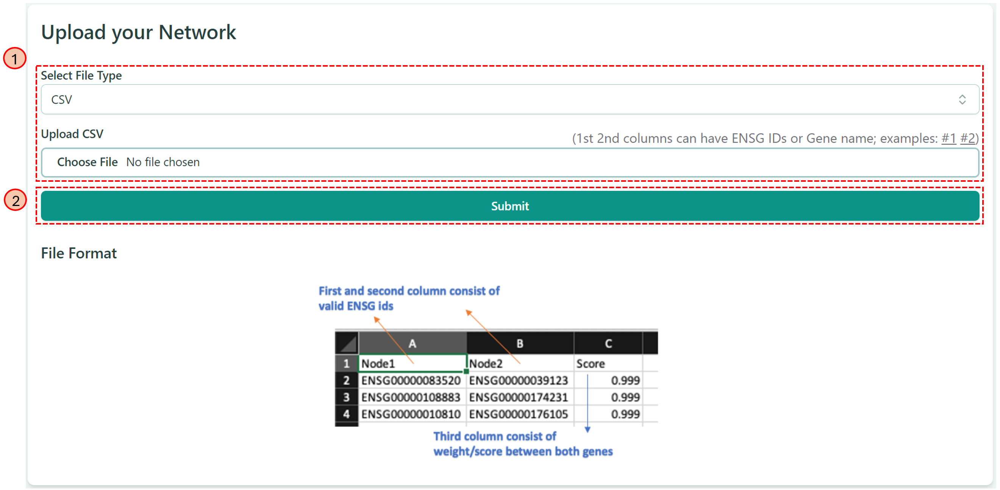

# Upload Network

At the main page of our website, you can also click the tab "Upload Network"  on the left panel, you will see the corresponding dashboard on the right as below:

<figure><figcaption>
Dashboard for "Upload Network"
</figcaption></figure>

### Step 1: Uploading the network file

You can upload your own network file, which contains the gene-gene interaction information, either in CSV format or in JSON format. An example is showing at the bottom of the above picture.

### Step 2: Clicking "Submit" Button

After click "Submit", our tool will lead you to the [network visualization page](../network-visualization/).
