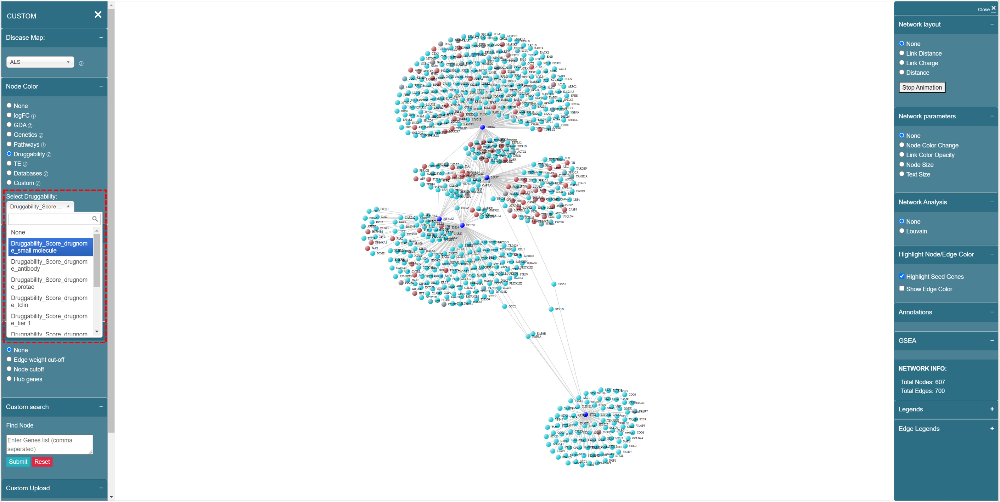

# Druggability

We use **{"Druggability"}\_{"Score"}\_{"drugnome"}\_{disease-agnostic/domain specific model}** as the format, for example, “Druggability\_Score\_drugnome\_small molecule”, shown as below:

<figure><figcaption>
Druggability data naming convention
</figcaption></figure>
