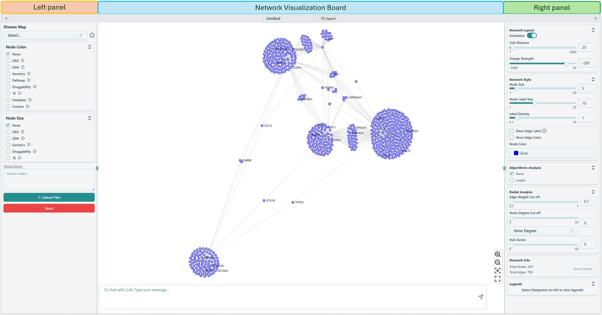
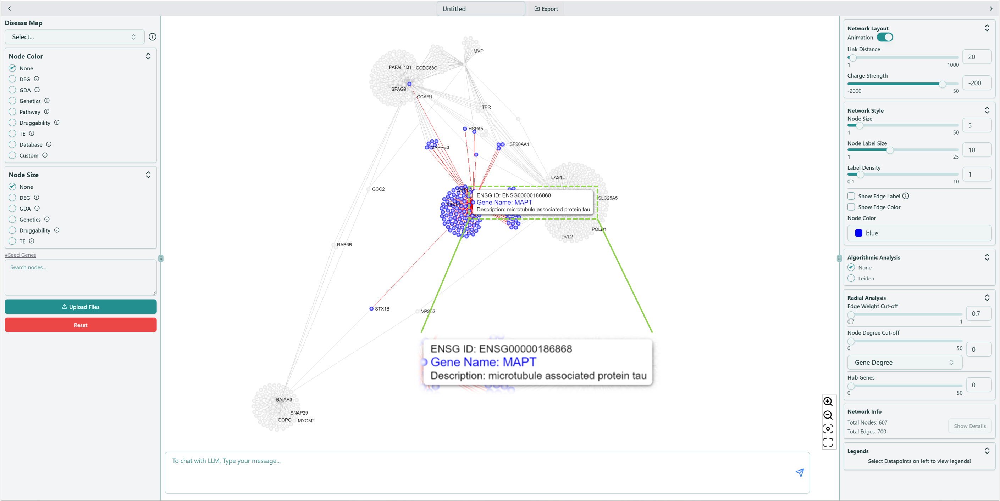

# Network Visualization

Right now you enter the network visualization page, shown as below, where you can analyze your network based on your selections on [Dashboard](../dashboard/).

<figure><figcaption>
Network visualization page
</figcaption></figure>

### Gene information

If you hover on an arbitrary gene (node), you are able to see the corresponding gene information, and all the genes connected with this hovered gene are also highlighted.

<figure><figcaption>
Gene information showing up while hovering the node
</figcaption></figure>

The network visualization page also contains the [Left panel](left-panel.md), [Right panel](right-panel.md) and [Network visualization board](network-visualization-board.md). Left panel focuses on the functions related to basic analysis of the network, while Right panel focuses on the advanced analysis functions and modifications of inherent network parameters. Network visualization board provides the interactive operations for users to apply various analysis on the network.
