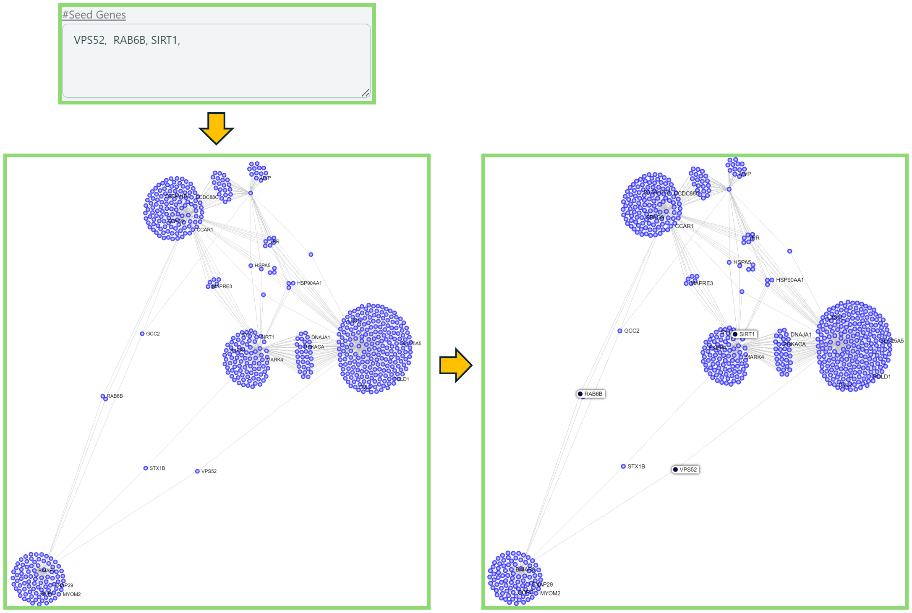

# Left panel

Once you decide the details of your own network, the network visualization page will show up for basic analysis purpose as below.

<figure><figcaption>
Left panel of network visualization page
</figcaption></figure>

Before going over the functions on the left panel, you might want to have some basic understandings of the data available in our tool.&#x20;

[Knowledge Base](../knowledge-base/) integrated in our tool is build based on [disease-dependent data](broken-reference) and [disease-independent data](broken-reference). Disease-dependent data indicates the data of specific features varies based on different diseases, while disease-independent data indicates the data remains the same once the disease changes.

Disease-dependent data includes [Differential Expression](broken-reference), [Target Disease Association ](broken-reference)and [Target Prioritization Factors](broken-reference), while disease-independent data includes [Pathways](../knowledge-base/pathways.md), [Druggability](../knowledge-base/druggability.md) and [Tissue Specificity](../knowledge-base/tissue-specificity.md). We also call these data types as **features**.

### Disease Map

Sometimes you may want to switch to another disease after generating the network visualization, no need to go back to the Dashboard to change the disease and re-render the network, here is a simple way to do it:

* Locate **Disease Map** on the top of the left panel and select the disease name that you want to switch to.&#x20;
* Please note that only the [disease-dependent data](broken-reference) will change if you switch to another disease.

<figure><figcaption>
Disease Map
</figcaption></figure>

### Change Node Color

You can change the node color by selecting different features.

1. Choose a feature.&#x20;
   * **Note**: You can hover on the info icon  to check the explanation.
2. Select the preferred option for that feature in the dropdown list. You can type the keyword in the search bar to help locate the data name.
   * **Note**: You can check the [Legends](right-panel.md#legends) section on the [Right panel](right-panel.md) to get the legend of each feature.

<figure><figcaption>
Change node color
</figcaption></figure>

### Change Node Size

You can change the node size by selecting a feature.&#x20;

1. Choose a feature.&#x20;
   * **Note**: You can hover on the info icon  to check the explanation.
2. Select the preferred data for that feature in the dropdown list. You can type the keyword in the search bar to help locate the data name.

<figure><figcaption>
Change node size
</figcaption></figure>

We provide less features in Node Size section simply because the feature Pathways is binary features -- either a gene exists in a pathway or it does not exist. However, to change the node size in a network, we need consistent data instead of the binary data.

### Combination of both Node Color and Node Size Change

Node color and node size can be both changed at the same time to highlight the corresponding genes, making them clearer.&#x20;

<figure><figcaption>
Change both node color and node size
</figcaption></figure>

### Custom Search

You can find nodes in the network.&#x20;

1. Locate the search box.
2. Enter the gene names or Ensemble IDs into the search box.&#x20;
   1. **Note**: to find seed genes, simply click #Seed Genes above the search box.
3. The nodes you are looking for will be highlighted in the network.

<figure><figcaption>
Custom search
</figcaption></figure>

### Custom Upload

You can upload your own customized data to analyze the network, instead of using the existing data.

1. Upload a **CSV** file with your own data, please refer to the [File Format](left-panel.md#file-format) below.
2. Click Submit.
3. Locate Node Color and/or Node Size section and select the corresponding uploaded feature name.
4. Select the column name of your customized data.

<figure><figcaption>
Custom upload
</figcaption></figure>

#### File Format

* The table below elaborates the naming convention, and the value ranges for all the supported features (data types).&#x20;
  * "Custom" data type is for customized color purpose. For example, if you find all the features do not fit your needs, you can create your own "customized feature" and color them by yourself.

<table><thead><tr><th width="189">Data Type</th><th>Column Naming Convention</th><th>Value range</th></tr></thead><tbody><tr><td>Differential Expression</td><td>DEG<mark style="color:red;">_CustomName</mark></td><td>[-Inf, +Inf]</td></tr><tr><td>Target Disease Association</td><td>OpenTargets<mark style="color:red;">_CustomName</mark></td><td>[0, 1]</td></tr><tr><td>Target Prioritization Factors</td><td>OT_Prioritization<mark style="color:red;">_CustomName</mark></td><td>[-1, 1]</td></tr><tr><td>Pathway</td><td>Pathway<mark style="color:red;">_CustomName</mark></td><td>binary</td></tr><tr><td>Druggability</td><td>Druggability<mark style="color:red;">_CustomName</mark></td><td>[0, 1]</td></tr><tr><td>Tissue Specificity</td><td>TE<mark style="color:red;">_CustomName</mark></td><td>[0, +Inf]</td></tr><tr><td>Custom</td><td>Custom_Color<mark style="color:red;">_CustomName</mark></td><td>red, green, blue, orange, yellow, black</td></tr></tbody></table>

* The CSV file below provides an example of what the real file looks like.
  * The first column must be either gene name or Ensembl id (column name doesn't matter)
  * The prefix of columns is case-insensitive

<figure><figcaption>
Example of a customized CSV file
</figcaption></figure>
