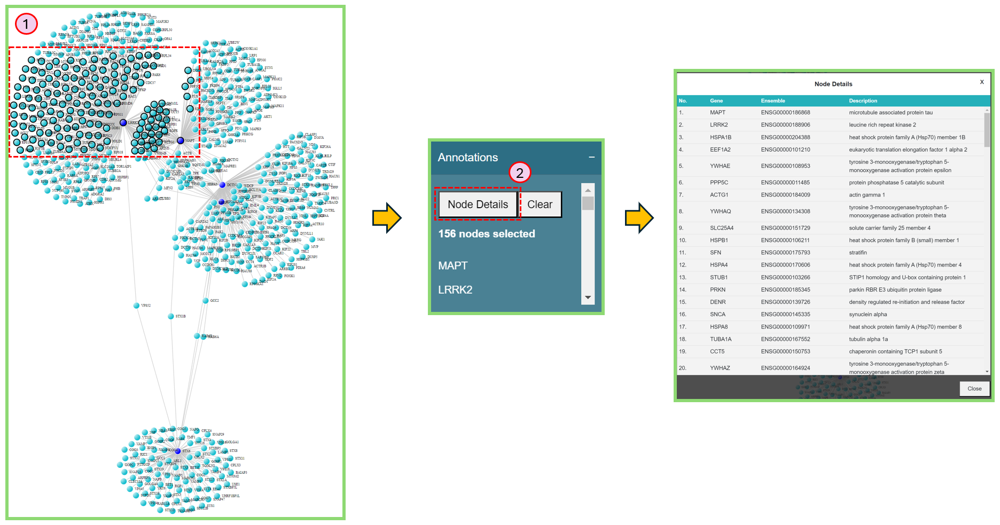
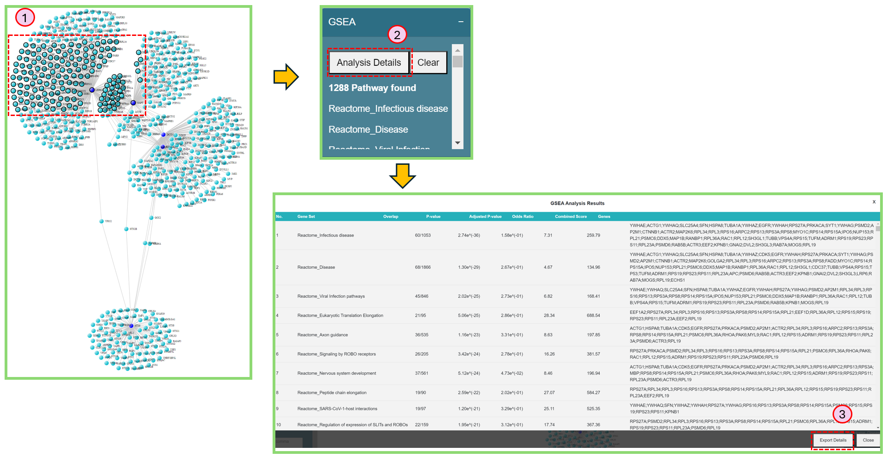

# Network visualization board

Now we focus on the functions of network visualization board.

<figure><figcaption>
Network visualization board
</figcaption></figure>

### Network Export

### Network Parameters

### Knowledge bot

| what is the role of ULK1 in tauopathy? |
| -------------------------------------- |
| KEGG\_Autophagy - animal               |
| ALS                                    |

### Annotations&#x20;

You can check the details of the selected nodes in Annotations section.

1. Press "shift" + left mouse button to select nodes on the network, and the selected nodes will be highlighted with black circle.
2. Click Node Details button to obtain the more detailed information of selected nodes.

<figure><figcaption>
Annotations
</figcaption></figure>

### GSEA

Similar to Annotation section, after select nodes on the network, you can find the GSEA analysis results in the GSEA section.

1. Press "shift" + left mouse button to select nodes on the network, and the selected nodes will be highlighted with black circle.
2. Click Analysis Details button to obtain the more detailed information of selected nodes.
3. If needed, Click Export Details button in the GSEA Analysis Results window to export the results.

<figure><figcaption>
GSEA
</figcaption></figure>
