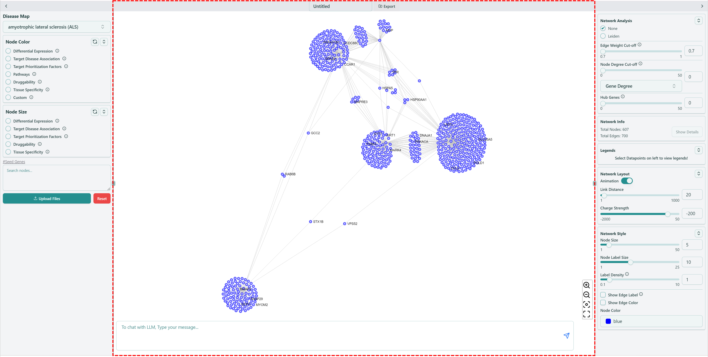
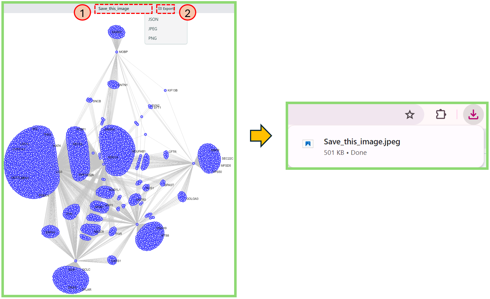
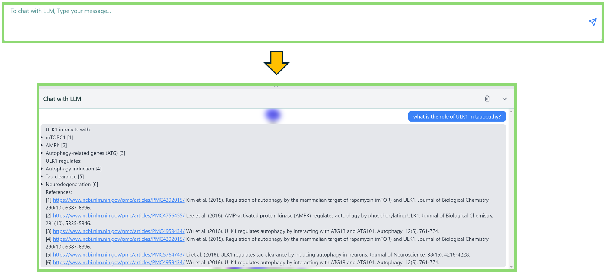
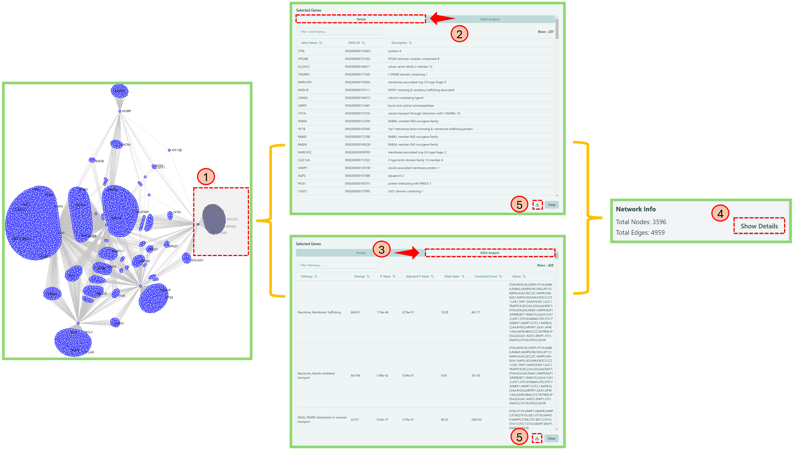

# Network visualization board

Now we focus on the functions of network visualization board.

<figure><figcaption>
Network visualization board
</figcaption></figure>

### Network Export

You can export the network you created.

1. Type in the name of your saved network.
2. Click "Export" and select proper format of your saved image.

<figure><figcaption>
Network export
</figcaption></figure>

### Network Parameters

On the right bottom corner of network visualization board, we have four different parameters to help you visualize the network better.

1. : zoom in the network
2. : zoom out the network
3. : center the network
4. : make the network visualization board full screen

### Knowledge bot

After created your network, you can ask questions regarding your network through our knowledge bot. For example, if you want to explore gene ULK1 more of ALS disease in KEGG\_Autophagy - animal, you can ask questions like "what is the role of ULK1 in tauopathy?", shown in the image below.

* **Note**: currently our knowledge bot cannot interact with the network, please pay attention to our next version!

<figure><figcaption>
Knowledge bot
</figcaption></figure>

### Node Details & GSEA

You can check the node details and perform GSEA (Gene Set Enrichment Analysis) on the network visualization board.

1. Press "shift" + left mouse button to select nodes on the network, and the selected nodes will be highlighted with black circle.
2. Click Details tab to obtain the detailed information of selected nodes.
3. Click GSEA Analysis tab to obtain the more detailed information of GSEA Analysis Results.
4. Navigate to [Network Info](right-panel.md#network-info) section of [Right panel](right-panel.md), click Show Details button to get back to the Node details and GSEA Analysis result window.
5. If needed, click download button in the window to export the results.

<figure><figcaption>
Node Details and GSEA
</figcaption></figure>

