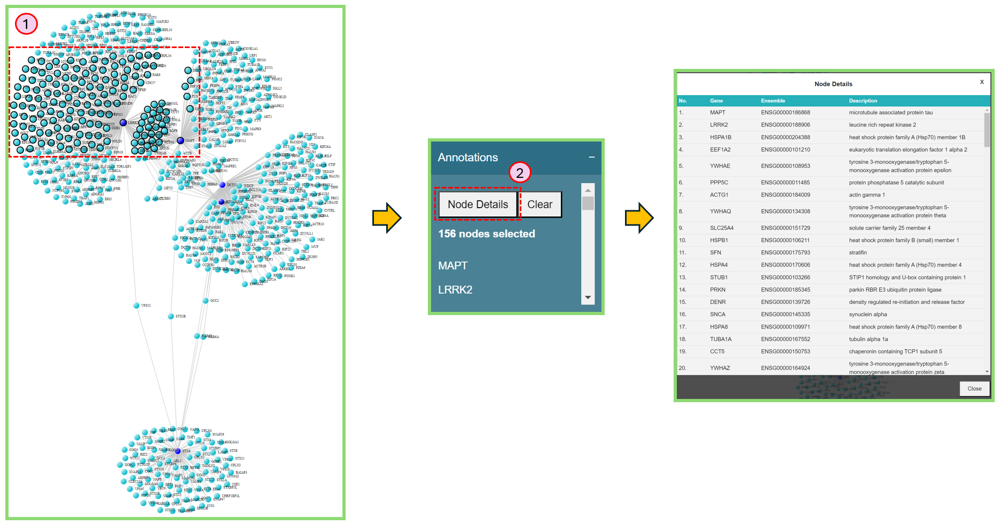
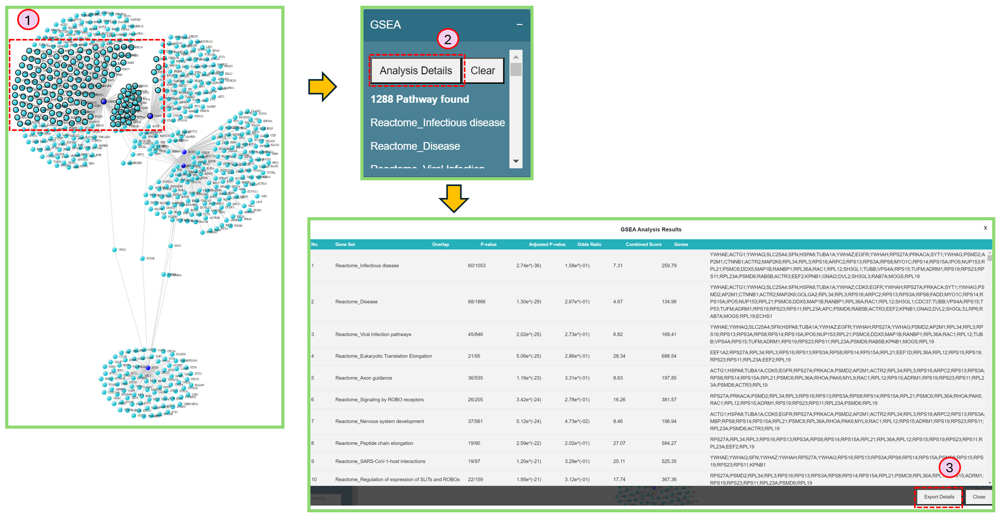

# Right panel

Now we focus on the functions of right panel.

<figure><figcaption>
Right panel of network visualization page
</figcaption></figure>

### Network Analysis

You can reduce the network complexity and focus on the key drivers of your network here by selecting different radio buttons.

* **Edge weight cut-off**

This feature allows you to filter out the nodes with less edge weight, so that you can focus more on the clustered nodes.

1. In the Radial Analysis section, select Edge weight cut-off.&#x20;
2. Use the range slider to select an appropriate value and filter out the nodes with edge weight less than the selected value.

<figure><figcaption>
Edge weight cut-off
</figcaption></figure>

* **Node cutoff**

This feature allows you to shrink the network based on the node degree of specific features.

1. In the Radial Analysis section, select Node cutoff.&#x20;
2. In the dropdown list, you can select your preferred feature and use the range slider to select an appropriate degree, making the network reduced as you want. We currently provide 2 types of values to reduce the network — Gene degree and Tissue Enrichment (TE) values.&#x20;

<figure><figcaption>
Node cutoff
</figcaption></figure>

* **Combination of Edge weight cut-off and Node cutoff**

You can first use Edge weight cut-off to filter out the nodes with less edge weight, then go to the Node cutoff and slide the value of node degree to 1. In this case, the desired clusters will stand out clearly.

<figure><figcaption>
Combination of Edge weight cut-off and Node cutoff
</figcaption></figure>

* **Hub genes**

Hub genes will highlight the nodes only with larger or equal to the number of edges defined by yourself. **Note**: before using this function, please make sure you've unchecked "Highlight Seed Genes" in the right panel.

1. In the Radial Analysis section, select Hub genes.&#x20;
2. Use the range slider to select an appropriate value to highlight the nodes with node degrees more than or equal to the selected value.

<figure><figcaption>
Hub genes
</figcaption></figure>

###

### Network Layout

You can make the node clusters more separated.

1. Select **Distance** or other options.
2. Select the distance value to separate the nodes.

<figure><figcaption>
Network layout
</figcaption></figure>

You can also use "Stop Animation" button to stop dancing of the network.

### Network Parameters

You can change basic parameters of the network, i.e. change the **Node Color**, **Link Opacity**, **Node Size** and **Text Size**. See below.

<figure><figcaption>
Network parameters
</figcaption></figure>

### Network Analysis

We offer community detection algorithm **Louvain** [\[1\]](right-panel.md#citation) in our tool, you can easily use this algorithm to find possible communities in the network, based on your own choice of **Resolution** and **Weighted**.

1. Click Louvain.
2. Select proper Resolution.
3. Check or uncheck Weighted, to involve edge weight or not.
4. Click Apply.

### Highlight Node/Edge Color

You can check/uncheck Highlight Seed Genes and Show Edge Color here. Please refer to [Property of seed genes](./#property-of-seed-genes) and [Property of Interactions](./#property-of-interactions) for more details.

### Annotations&#x20;

You can check the details of the selected nodes in Annotations section.

1. Press "shift" + left mouse button to select nodes on the network, and the selected nodes will be highlighted with black circle.
2. Click Node Details button to obtain the more detailed information of selected nodes.

<figure><figcaption>
Annotations
</figcaption></figure>

### GSEA

Similar to Annotation section, after select nodes on the network, you can find the GSEA analysis results in the GSEA section.

1. Press "shift" + left mouse button to select nodes on the network, and the selected nodes will be highlighted with black circle.
2. Click Analysis Details button to obtain the more detailed information of selected nodes.
3. If needed, Click Export Details button in the GSEA Analysis Results window to export the results.

<figure><figcaption>
GSEA
</figcaption></figure>

### Network Info

When the network is rendered, the basic information of the network is shown here, i.e. total nodes, total edges.

### Legends

You can see the Legend of each feature in Node Color section.

1. Choose a feature in Node Color section on the [Left panel](left-panel.md), then navigate to Legends section on the [Right panel](right-panel.md) to get the legend of a specific feature.

<figure><figcaption>
Legends when choosing logFC in Node Color
</figcaption></figure>

### Edge Legends

Please refer to [Property of Interactions](./#property-of-interactions) for more details.

### Property of interactions

The interactions (edges) can be colored following the heat map color palette, i.e. the more yellow-ish color indicates the smaller interaction score (edge weight), the more red-ish color indicates the larger interaction score. You can also check "Edge Legends" section on the bottom of the right panel.

Similarly, you can change this property on the right panel by checking/unchecking the "Show Edge Color" in the "Highlight Node/Edge Color" section.

<figure><figcaption></figcaption></figure>

***

#### Citation 1

> _\[1] Traag, V. A., et al. « From Louvain to Leiden: Guaranteeing Well-Connected Communities ». Scientific Reports, vol. 9, no 1, décembre 2019, p. 5233. DOI.org (Crossref), doi:10.1038/s41598-019-41695-z. https://arxiv.org/abs/1810.08473_
